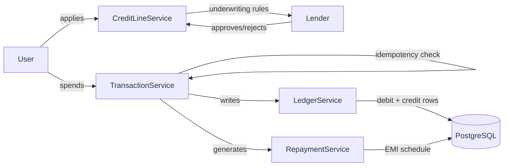
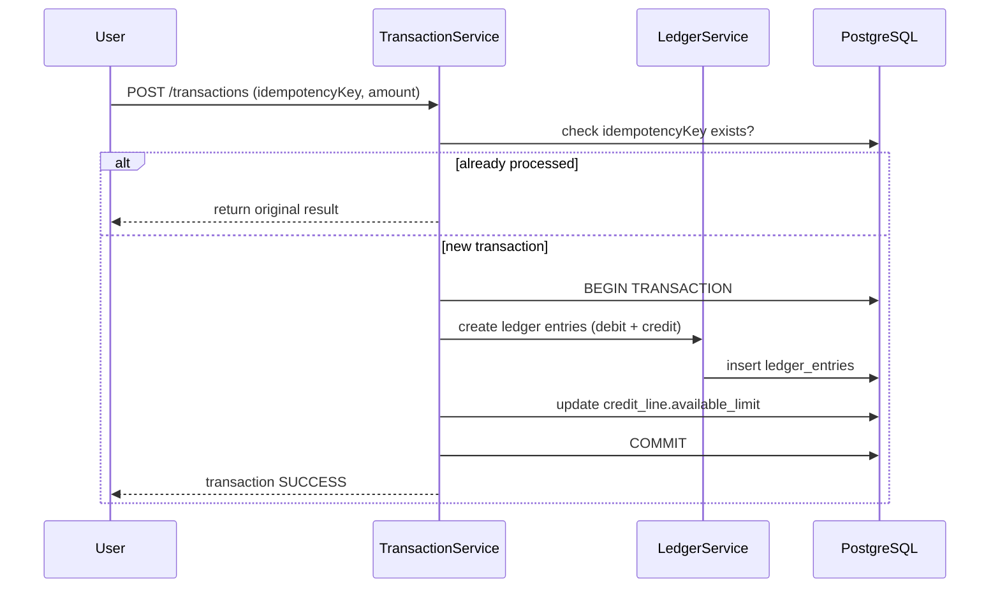

# FluxUPI

A simulated **UPI-based digital credit line** engine — modeling the
DLA (Digital Lending App) ↔ Lender embedded-credit integration pattern used
by real UPI credit products.

> **Disclaimer:** This is a learning/portfolio project. No real bank, NPCI,
> or UPI payment rail is integrated. All lenders, VPAs, and transactions are
> mocked/simulated within this codebase — no real money moves, no KYC, no
> licensing required.

---

## What it does

1. A user is issued a **credit line** by one of several mock **lenders**,
   each with its own eligibility rule and interest strategy.
2. The user "spends" against the credit line via simulated UPI transactions.
3. Every transaction is recorded as a **double-entry ledger** entry — debits
   always equal credits.
4. Spends are converted into an **EMI/repayment schedule**, which the user
   pays down over time.
5. The credit line and each transaction move through explicit **state
   machines** (no implicit status flags).

---

## Architecture





---

## Tech Stack

| Layer | Technology |
|---|---|
| Language / Framework | Java 21, Spring Boot 3 |
| Database | PostgreSQL |
| Migrations | Flyway |
| API | REST, documented via OpenAPI/Swagger |
| Testing | JUnit5, Testcontainers (real Postgres in tests) |
| Containerization | Docker, Docker Compose |
| CI/CD | GitHub Actions |
| Build | Maven |

---

## Core Entities

- **User** — mock identity, linked mock VPA
- **Lender** — pluggable eligibility rule + interest strategy
- **CreditLine** — `PENDING → APPROVED → ACTIVE → FROZEN → CLOSED/DEFAULTED`
- **Transaction** — `INITIATED → SUCCESS/FAILED/REVERSED`, carries an idempotency key
- **LedgerEntry** — every transaction produces ≥2 rows; debits always equal credits
- **RepaymentSchedule** — `UPCOMING → DUE → PAID/OVERDUE`

## Design Patterns Used

| Pattern | Where | Why |
|---|---|---|
| State | `CreditLine`, `Transaction` lifecycle | Explicit, guarded transitions instead of enum + if-chains |
| Strategy | Interest calculation (flat vs reducing-balance), lender eligibility rules | Swappable business logic per lender |
| Factory | Lender selection/instantiation | Decouples creation from usage |
| Observer | Webhook simulation on settlement/repayment-due events | Mirrors real async lender notifications |

---

## API Endpoints

```
POST   /users
POST   /credit-lines
GET    /credit-lines/{id}
POST   /transactions
GET    /transactions/{id}
POST   /transactions/{id}/reverse
GET    /credit-lines/{id}/statement
POST   /repayments
```

Full request/response schemas are in `openapi.yaml` once generated (Spring
will auto-generate this from `springdoc-openapi` — see `pom.xml`).

---

## Getting Started

```bash
# 1. Start Postgres
docker compose up -d postgres

# 2. Run migrations + start the app
./mvnw spring-boot:run

# 3a. Unit tests + LedgerReconciliationTest (needs Docker for Testcontainers)
./mvnw test

# 3b. Full gate: unit + all Testcontainers integration tests
./mvnw verify

# 4. (optional) seed 25 users + 1,200+ transactions and print a reconciliation report
./scripts/seed_transactions.sh          # or: ./mvnw spring-boot:run -Dspring-boot.run.profiles=seed
```

App runs on `http://localhost:8080`. Swagger UI at `/swagger-ui.html`,
OpenAPI JSON at `/v3/api-docs`.

Three mock lenders are seeded by Flyway on first start: `QUICKCASH` (flat
rate), `PRUDENT` (reducing balance), `STARTER` (small limits).

### Docker note

Testcontainers needs a Docker endpoint it can reach. On Docker Desktop for
Windows/Mac, if `./mvnw verify` reports "Could not find a valid Docker
environment", the bundled Docker client version may not negotiate the API —
this project pins Testcontainers 1.21.x which handles it. As a fallback,
enable *Settings → Advanced → Expose daemon on tcp://localhost:2375*.

---

## Verifying the ledger invariant

The core claim of this project — **100% debit-credit reconciliation** — is
enforced by `LedgerReconciliationTest`, which seeds 1,000+ simulated
transactions and asserts `SUM(debit) == SUM(credit)` per transaction and
globally. Run it with:

```bash
./mvnw test -Dtest=LedgerReconciliationTest
```

---

## Build Roadmap

- [x] Core domain models + Flyway schema + `CreditLine` state machine + unit tests
- [x] `Transaction` + double-entry `LedgerService` + idempotency handling
- [x] Interest strategies + `RepaymentSchedule` generation (EMI math)
- [x] Mock underwriting rule engine
- [x] Docker Compose + GitHub Actions CI
- [x] Testcontainers integration tests + seed script for 1,000+ transactions
- [x] Swagger docs + REST layer for every endpoint above

Current test coverage: ~145 unit tests (`mvn test`) plus ~28 Testcontainers
integration tests (`mvn verify`), including 4 concurrency tests and a
1,200-transaction `LedgerReconciliationTest`.

See `CLAUDE.md` for detailed build instructions and conventions for AI-assisted development in this repo.
